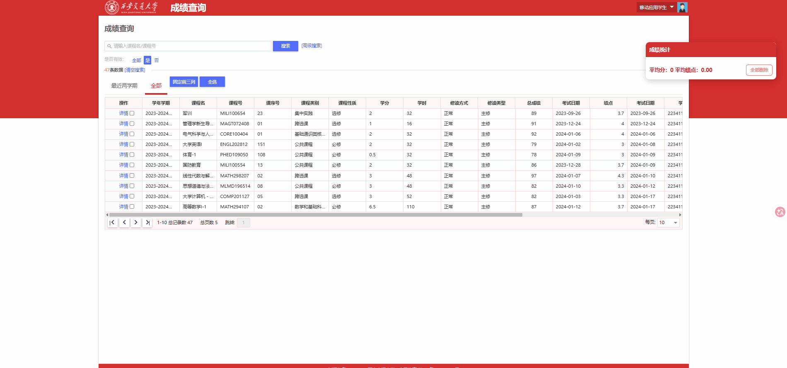
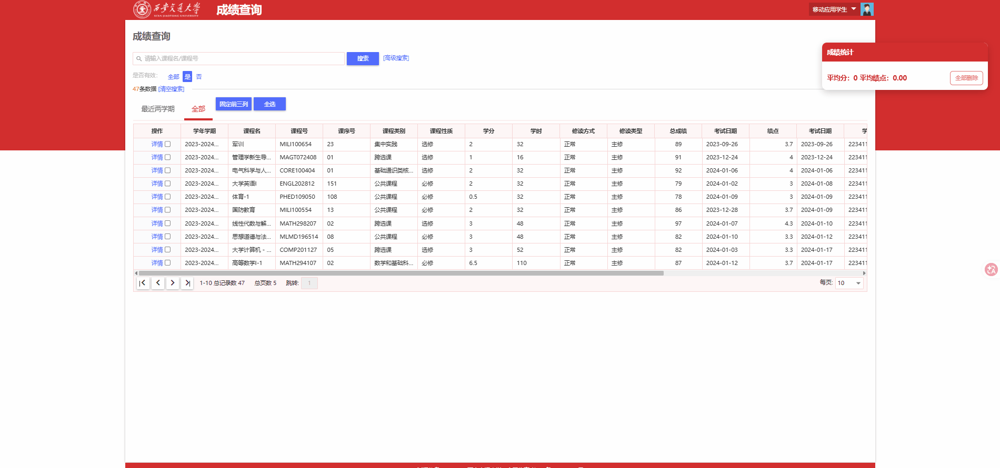

# xjtu-tools

[](https://opensource.org/licenses/MIT)
[](https://developer.chrome.com/docs/extensions/)

这是一个方便**XJTUers**的效率工具，可以在[西交本科教务官网](https://ehall.xjtu.edu.cn/new/index.html?browser=no)帮助你查询小分成绩、计算平均成绩（绩点）、一键评教以及在[学习平台](https://class.xjtu.edu.cn/user/courses#/?pageIndex=1)下载PDF等功能。

## 功能特性

- **核心功能1**：查询成绩详细构成信息。


- **核心功能2**：计算平均成绩、平均绩点

- **核心功能3**：一键评教。
- **核心功能4**：下载PDF资料。

## 安装方法

由于未上架Chrome应用商店，请通过以下方式手动安装：

### 推荐：从 Releases 安装（最稳定）
1.  前往本项目的 [**Releases**](https://github.com/c-l-china/xjtu-tools/releases) 页面。
2.  下载最新版本下的 `zip` 文件。
3.  将下载的ZIP文件**解压**到电脑上一个你会长期保留的文件夹。
4.  打开Chrome浏览器，在地址栏输入 `chrome://extensions/` 并访问。
5.  打开页面右上角的 **“开发者模式”** 开关。
6.  点击页面左上角的 **“加载已解压的扩展程序”** 按钮。
7.  在弹出的文件选择器中，选中**第3步中解压得到的整个文件夹**，然后点击“选择文件夹”。
8.  安装完成！扩展的图标通常会出现在浏览器工具栏的拼图按钮里。

**注意：在第7步中一定选择直接含有`manifest.json`的文件夹**

### 开发者：从源码安装
如果你想贡献代码或体验最新开发版：
```bash
git clone https://github.com/c-l-china/xjtu-tools.git
cd xjtu-tools
```
